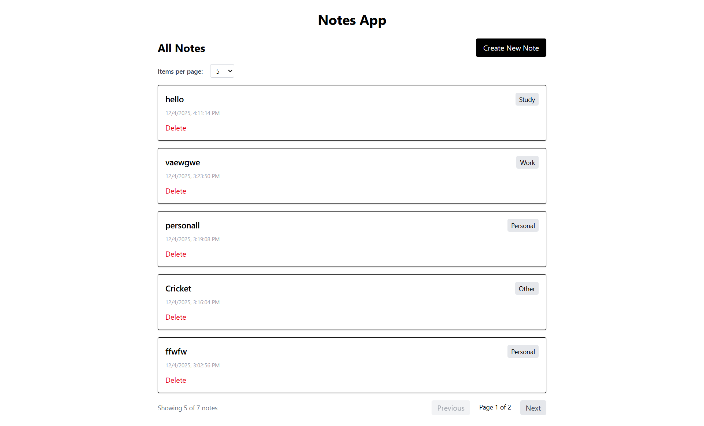
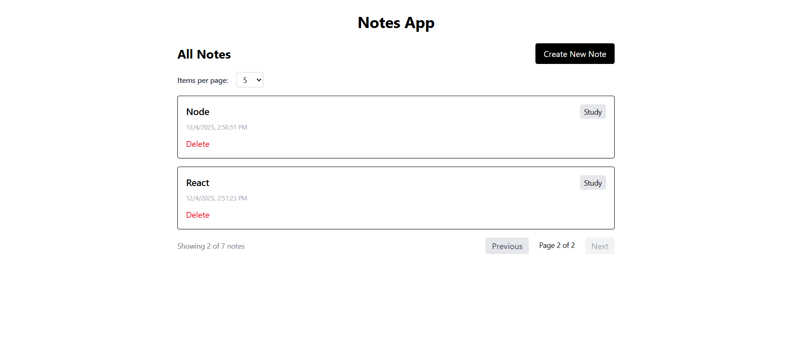

# Pagination - MERN Stack Project


## 📋 Table of Contents
- [Overview](#overview)
- [Concepts Covered](#concepts-covered)
- [Features](#features)
- [Folder Structure](#folder-structure)
- [Prerequisites](#prerequisites)
- [Installation & Setup](#installation--setup)
- [Environment Variables](#environment-variables)
- [Running the Project](#running-the-project)
- [API Endpoints](#api-endpoints)
- [Screenshots](#screenshots)
- [Troubleshooting](#troubleshooting)

## 🎯 Overview
Pagination is a MERN stack application that demonstrates how to:
- Implement efficient pagination for large datasets
- Set up a Node.js backend with Express
- Connect to MongoDB using Mongoose
- Configure environment variables securely
- Create a React frontend to manage notes with paginated views
- Handle CRUD operations with pagination, sorting, and search

## 📚 Concepts Covered
- **Node.js Project Setup**
  - Express server configuration
  - Middleware setup (CORS, JSON parsing)
  - Project structure organization
- **Environment Variables**
  - Using .env files for sensitive data
  - dotenv package implementation
  - Security best practices
- **MongoDB Connection**
  - Mongoose ODM setup
  - Connection string configuration
  - Connection status monitoring
  - Error handling and retries
- **Pagination Implementation**
  - Server-side pagination with skip and limit
  - Metadata calculation (total pages, current page)
  - Efficient querying for large datasets
- **Note Management**
  - CRUD operations (Create, Read, Update, Delete)
  - Advanced querying with filters
  - Text search functionality
  - Sorting options
- **React Frontend**
  - Component-based architecture
  - State management
  - API integration with Axios
  - Responsive UI with Tailwind CSS

## ✨ Features
✅ **Note CRUD Operations** - Create, view, update, and delete notes  
✅ **Text Search** - Search within note titles and content  
✅ **Sorting Options** - Sort by creation date (newest/oldest first)   
✅ **Pagination** - Efficient pagination for handling large lists of notes  
✅ **Category Management** - Dynamic category fetching and selection  
✅ **Responsive Design** - Mobile-friendly interface with Tailwind CSS  
✅ **RESTful API** - Well-structured API endpoints  
✅ **Error Handling** - Comprehensive error handling and logging  
✅ **Environment Configuration** - Secure environment variable management  

## 📁 Folder Structure
```
Pagination/
│
├── backend/
│   ├── config/
│   │   └── db.js              # MongoDB connection logic
│   ├── controllers/
│   │   └── noteController.js  # Note CRUD operations and pagination
│   ├── middleware/
│   │   └── errorMiddleware.js # Error handling middleware
│   ├── models/
│   │   └── Note.js            # Note data model
│   ├── routes/
│   │   └── noteRoute.js       # API routes for notes
│   ├── .env                   # Environment variables (not in git)
│   ├── .env.example           # Example env file
│   ├── .gitignore            # Git ignore file
│   ├── server.js             # Main server file
│   └── package.json          # Backend dependencies
│
├── frontend/
│   ├── public/
│   │   └── index.html
│   ├── src/
│   │   ├── components/
│   │   │   ├── NoteForm.jsx      # Form for creating notes
│   │   │   ├── NoteFilters.jsx   # Filtering and search components
│   │   │   ├── NoteList.jsx      # Display list of notes with pagination
│   │   │   └── NotesPage.jsx     # Main notes page component
│   │   ├── pages/
│   │   │   ├── AllNotesPage.jsx  # Page for viewing all notes with pagination
│   │   │   └── CreateNotePage.jsx # Page for creating new notes
│   │   ├── App.jsx              # Main React component
│   │   ├── App.css              # Styling
│   │   ├── api.js               # API configuration
│   │   ├── index.css            # Global styles
│   │   └── main.jsx             # React entry point
│   ├── .env                     # Frontend env variables
│   ├── .env.example
│   ├── .gitignore
│   └── package.json             # Frontend dependencies
│
├── screenshots/                 # Project screenshots
│   ├── image1.png
│   ├── image2.png
│
└── README.md                   # Project documentation
```

## 🔧 Prerequisites
Before running this project, make sure you have:
- Node.js (v14 or higher) - [Download](https://nodejs.org/)
- npm or yarn package manager
- MongoDB Atlas Account (free tier) - [Sign Up](https://www.mongodb.com/atlas)
- Git (optional) - [Download](https://git-scm.com/)

## 💻 Installation & Setup
### Step 1: Clone or Download the Project
```bash
# Clone the repository
git clone <repository-url>
cd Pagination

# OR download and extract the ZIP file
```

### Step 2: Backend Setup
```bash
# Navigate to backend folder
cd backend

# Install dependencies
npm install
```

**Backend Dependencies:**
- `express`: Web framework
- `mongoose`: MongoDB ODM
- `dotenv`: Environment variable management
- `cors`: Cross-Origin Resource Sharing
- `nodemon`: Auto-restart development server (dev dependency)

### Step 3: Frontend Setup
```bash
# Open a new terminal and navigate to frontend folder
cd frontend

# Install dependencies
npm install
```

**Frontend Dependencies:**
- `react`: UI library
- `react-dom`: React DOM rendering
- `react-router-dom`: Routing for React
- `axios`: HTTP client for API calls
- `tailwindcss`: Utility-first CSS framework
- `@tailwindcss/vite`: Tailwind CSS integration for Vite

## 🔐 Environment Variables
### Backend (.env)
Create a `.env` file in the backend folder:

```env
# Server Configuration
PORT=5000
NODE_ENV=development

# MongoDB Configuration
MONGODB_URI=mongodb+srv://<username>:<password>@cluster0.xxxxx.mongodb.net/<dbname>?retryWrites=true&w=majority

# Client Origin (for CORS)
CLIENT_ORIGIN=http://localhost:5173
```

**How to get MongoDB URI:**
1. Go to [MongoDB Atlas](https://www.mongodb.com/atlas)
2. Create a free cluster
3. Click "Connect" → "Connect your application"
4. Copy the connection string
5. Replace `<username>`, `<password>`, and `<dbname>`

### Frontend (.env)
Create a `.env` file in the frontend folder:

```env
VITE_API_URL=http://localhost:5000
```

## 🚀 Running the Project
### Option 1: Run Both Servers Separately (Recommended for Development)
**Terminal 1 - Backend:**
```bash
cd backend
npm run dev
# Server will start on http://localhost:5000
```

**Terminal 2 - Frontend:**
```bash
cd frontend
npm run dev
# React app will open on http://localhost:5173
```

### Option 2: Production Build
**Backend:**
```bash
cd backend
npm start
```

**Frontend:**
```bash
cd frontend
npm run build
# Serve the build folder with a static server
```

## 📡 API Endpoints
| Method | Endpoint | Description |
|--------|----------|-------------|
| GET | `/api/notes` | Get all notes with optional filters, search, sort, pagination |
| POST | `/api/notes` | Create a new note |
| PUT | `/api/notes/:id` | Update a note by ID |
| DELETE | `/api/notes/:id` | Delete a note by ID |
| GET | `/api/notes/categories` | Get all unique categories |

### Query Parameters for GET /api/notes
- `category`: Filter by category (e.g., `?category=Work`)
- `search`: Search in title/content (e.g., `?search=meeting`)
- `sort`: Sort by createdAt (`asc` or `desc`, default: `desc`)
- `fields`: Projection (e.g., `?fields=title,category`)
- `page`: Page number (default: 1)
- `limit`: Items per page (default: 5)

### Example API Responses
**Success Response:**
```json
{
  "data": [
    {
      "_id": "64f...",
      "title": "Meeting Notes",
      "content": "Discussed project timeline...",
      "category": "Work",
      "createdAt": "2023-09-01T10:00:00.000Z"
    }
  ],
  "meta": {
    "total": 25,
    "page": 1,
    "limit": 5,
    "totalPages": 5
  }
}
```

**Error Response:**
```json
{
  "message": "Note not found",
  "stack": "..."
}
```

## 📸 Screenshots
1. **Home Page** - View and filter all notes with pagination

1. **All Notes Page** - View and filter all notes with pagination controls


## 🎨 Functionalities Explained
### Backend Functionalities
**MongoDB Connection (config/db.js)**
- Establishes connection to MongoDB using Mongoose
- Implements connection options for stability
- Handles connection events (connected, error, disconnected)

**Express Server (server.js)**
- Sets up Express application
- Configures middleware (CORS, JSON parser)
- Defines API routes
- Starts server on specified port

**Note Controller (controllers/noteController.js)**
- Handles CRUD operations for notes
- Implements advanced querying with search, pagination
- Manages category retrieval
- Calculates pagination metadata efficiently

**Note Routes (routes/noteRoute.js)**
- Defines RESTful API endpoints
- Routes requests to appropriate controller methods

### Frontend Functionalities
**Note Form Component**
- Form for creating new notes
- Input validation
- Category selection

**Note Filters Component**
- Category filtering dropdown
- Sort options (newest/oldest)
- Search input field
- Dynamic category loading

**Note List Component**
- Displays notes in a responsive grid
- Edit and delete actions
- Pagination controls and information

**Pages**
- AllNotesPage: Main page with filters, note list, and pagination
- CreateNotePage: Dedicated page for note creation

## 🐛 Troubleshooting
### Common Issues
1. **"MongoDB connection failed"**
   - ✅ Verify your MongoDB URI in `.env`
   - ✅ Check username and password are correct
   - ✅ Ensure your IP is whitelisted in MongoDB Atlas (0.0.0.0/0 for development)
   - ✅ Verify database user has proper permissions

2. **"Cannot connect to backend"**
   - ✅ Ensure backend server is running on port 5000
   - ✅ Check `VITE_API_URL` in frontend `.env`
   - ✅ Verify CORS is properly configured

3. **"Port already in use"**
   - ✅ Kill the process using the port: `lsof -ti:5000 | xargs kill -9` (Mac/Linux)
   - ✅ Or change the PORT in backend `.env`

4. **"Module not found" errors**
   - ✅ Run `npm install` in both backend and frontend folders
   - ✅ Delete `node_modules` and `package-lock.json`, then reinstall

5. **React app doesn't update**
   - ✅ Clear browser cache (Ctrl+Shift+R or Cmd+Shift+R)
   - ✅ Check browser console for errors
   - ✅ Verify API URL is correct

## 📝 Additional Notes
### Security Best Practices
- Never commit `.env` files to Git
- Use strong passwords for MongoDB
- Restrict MongoDB Atlas IP whitelist in production
- Use environment variables for all sensitive data

### Development Tips
- Use nodemon for auto-restarting backend during development
- Enable React Developer Tools for debugging
- Check MongoDB Atlas logs for connection issues
- Use Postman to test API endpoints independently

## 📚 Learning Outcomes
After completing this project, you will understand:
- How to structure a MERN stack application
- Environment variable management and security
- MongoDB connection setup and monitoring
- Implementing efficient pagination in MongoDB and Express
- RESTful API design principles
- React component architecture
- Frontend-backend communication
- Error handling best practices

## 📞 Support
If you encounter any issues:
1. Check the Troubleshooting section above
2. Review the console logs (both frontend and backend)
3. Verify all environment variables are set correctly
4. Ensure all dependencies are installed

Happy Coding! 🚀

Made with ❤️ for learning MERN stack development and pagination techniques.
