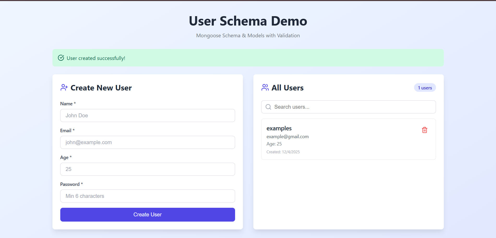
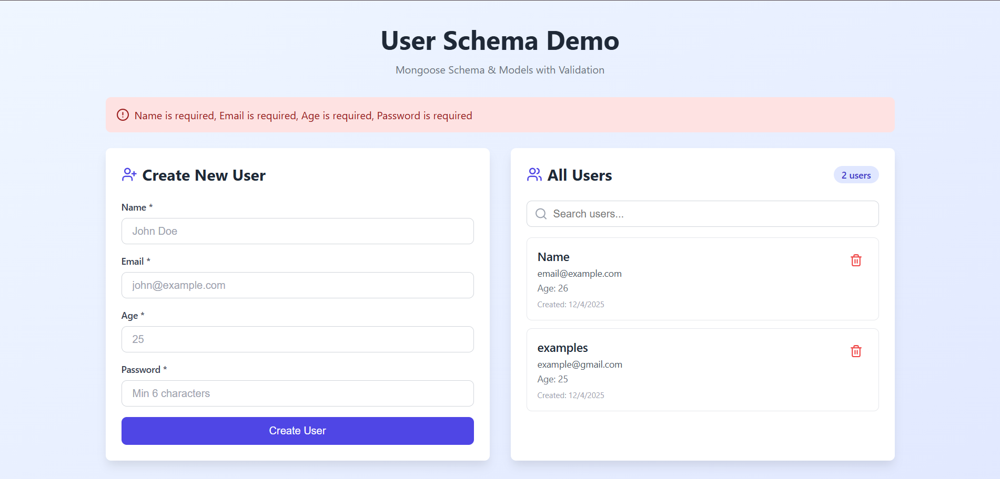

# 🎯 User Schema Demo - MERN Stack Application

A complete MERN (MongoDB, Express.js, React.js, Node.js) stack application demonstrating **Mongoose Schema & Models** with comprehensive **Validation**.

---

## 📋 Table of Contents
- [Project Overview](#project-overview)
- [Concepts Covered](#concepts-covered)
- [Key Features](#key-features)
- [Folder Structure](#folder-structure)
- [Prerequisites](#prerequisites)
- [Installation Steps](#installation-steps)
- [Running the Project](#running-the-project)
- [API Endpoints](#api-endpoints)
- [Schema & Validation Rules](#schema--validation-rules)
- [Functionality Explanation](#functionality-explanation)
- [Screenshots](#screenshots)
- [Technologies Used](#technologies-used)
- [Troubleshooting](#troubleshooting)

---

## 🎓 Project Overview

This project demonstrates the implementation of a **User Management System** using Mongoose schemas with built-in validation. It includes both frontend and backend implementations showcasing CRUD operations (Create, Read, Update, Delete) with proper error handling and data validation.

---

## 💡 Concepts Covered

1. **Mongoose Schema Definition**
   - Creating schemas with specific field types
   - Setting required fields
   - Default values and timestamps

2. **Data Validation**
   - Built-in validators (required, minlength, maxlength, min, max)
   - Custom validators
   - Email format validation with regex
   - Unique field constraints

3. **Mongoose Models**
   - Creating models from schemas
   - Model methods and statics
   - Pre-save middleware (hooks)

4. **Password Security**
   - Password hashing with bcrypt
   - Pre-save hooks for encryption
   - Password comparison methods

5. **RESTful API Design**
   - GET, POST, PUT, DELETE operations
   - Proper HTTP status codes
   - Error handling and responses

---

## ✨ Key Features

### Backend Features
- ✅ Complete User Schema with validation
- ✅ Password hashing with bcrypt
- ✅ Email uniqueness validation
- ✅ Age range validation (1-120)
- ✅ Name length validation (2-50 characters)
- ✅ Automatic timestamp generation
- ✅ RESTful API endpoints
- ✅ Error handling middleware
- ✅ MongoDB connection with Mongoose

### Frontend Features
- ✅ Modern React.js interface with Tailwind CSS
- ✅ Real-time user creation and display
- ✅ Search functionality for users
- ✅ Delete user functionality
- ✅ Form validation
- ✅ Success/Error messages
- ✅ Responsive design
- ✅ Loading states

---

## 📁 Folder Structure

```
user-schema-demo/
│
├── backend/
│   ├── config/
│   │   └── db.js                 # MongoDB connection configuration
│   ├── models/
│   │   └── User.js               # User Mongoose Schema & Model
│   ├── routes/
│   │   └── userRoutes.js         # API routes for user operations
│   ├── .env                      # Environment variables
│   ├── server.js                 # Main server file
│   └── package.json              # Backend dependencies
│
├── frontend/
│   ├── public/
│   │   └── index.html
│   ├── src/
│   │   ├── App.js                # Main React component
│   │   ├── index.js              # Entry point
│   │   └── index.css             # Tailwind CSS imports
│   ├── package.json              # Frontend dependencies
│   └── tailwind.config.js        # Tailwind configuration
│
├── screenshots/                   # Project screenshots
│   ├── home-page.png
│   ├── create-user.png
│   ├── user-list.png
│   └── validation-error.png
│
└── README.md                      # Project documentation
```

---

## 🔧 Prerequisites

Before running this project, ensure you have the following installed:

- **Node.js** (v14 or higher) - [Download](https://nodejs.org/)
- **MongoDB** (v4.4 or higher) - [Download](https://www.mongodb.com/try/download/community)
- **npm** or **yarn** package manager
- **Git** (optional)

### Check Installation:
```bash
node --version
npm --version
mongo --version
```

---

## 📥 Installation Steps

### Step 1: Clone or Download the Project

```bash
# Clone the repository (if using Git)
git clone <repository-url>
cd user-schema-demo

# OR download and extract the ZIP file
```

### Step 2: Backend Setup

```bash
# Navigate to backend folder
cd backend

# Install dependencies
npm install

# Create .env file
touch .env
```

**Add the following to `.env` file:**
```env
MONGODB_URI=mongodb://localhost:27017/user-schema-demo
PORT=5000
```

### Step 3: Frontend Setup

```bash
# Navigate to frontend folder (from root)
cd frontend

# Install dependencies
npm install
```

---

## 🚀 Running the Project

### Step 1: Start MongoDB

**Windows:**
```bash
mongod
```

**macOS/Linux:**
```bash
sudo systemctl start mongod
# OR
brew services start mongodb-community
```

### Step 2: Start Backend Server

Open a terminal in the `backend` folder:
```bash
cd backend
npm run dev
# OR
npm start
```

You should see:
```
✅ MongoDB Connected Successfully
🚀 Server running on port 5000
```

### Step 3: Start Frontend Application

Open another terminal in the `frontend` folder:
```bash
cd frontend
npm start
```

The application will automatically open at `http://localhost:3000`

---

## 🔌 API Endpoints

### Base URL: `http://localhost:5000/api`

| Method | Endpoint | Description |
|--------|----------|-------------|
| GET | `/users` | Get all users |
| GET | `/users/:id` | Get single user by ID |
| POST | `/users` | Create new user |
| PUT | `/users/:id` | Update user by ID |
| DELETE | `/users/:id` | Delete user by ID |

### Example Requests:

**Create User (POST /api/users)**
```json
{
  "name": "John Doe",
  "email": "john@example.com",
  "age": 25,
  "password": "password123"
}
```

**Response:**
```json
{
  "_id": "507f1f77bcf86cd799439011",
  "name": "John Doe",
  "email": "john@example.com",
  "age": 25,
  "createdAt": "2024-01-15T10:30:00.000Z",
  "updatedAt": "2024-01-15T10:30:00.000Z"
}
```

---

## ✅ Schema & Validation Rules

### User Schema Fields:

| Field | Type | Validation Rules |
|-------|------|------------------|
| **name** | String | Required, 2-50 characters, trimmed |
| **email** | String | Required, unique, valid email format, lowercase |
| **age** | Number | Required, 1-120 range |
| **password** | String | Required, minimum 6 characters, hashed |
| **createdAt** | Date | Auto-generated timestamp |
| **updatedAt** | Date | Auto-updated timestamp |

### Validation Details:

**1. Name Validation:**
- Must be provided (required)
- Minimum 2 characters
- Maximum 50 characters
- Whitespace automatically trimmed

**2. Email Validation:**
- Must be provided (required)
- Must be unique in database
- Must match valid email format
- Automatically converted to lowercase

**3. Age Validation:**
- Must be provided (required)
- Minimum value: 1
- Maximum value: 120

**4. Password Validation:**
- Must be provided (required)
- Minimum 6 characters
- Automatically hashed before saving (bcrypt)
- Not returned in API responses

---

## 🔍 Functionality Explanation

### 1. **User Creation**
- Frontend collects user data via form
- Data is validated on client-side first
- POST request sent to `/api/users`
- Backend validates data against schema
- If validation passes, password is hashed
- User is saved to MongoDB
- Success/error message displayed

### 2. **Fetching Users**
- On component mount, GET request to `/api/users`
- All users retrieved from database
- Users displayed in list (sorted by creation date)
- Passwords excluded from response

### 3. **Search Functionality**
- Real-time filtering of displayed users
- Search by name or email
- No database queries (filters existing data)

### 4. **Delete User**
- Confirmation dialog before deletion
- DELETE request to `/api/users/:id`
- User removed from database
- List automatically refreshed

### 5. **Password Security**
- Pre-save middleware intercepts save operation
- Password is hashed using bcrypt (10 salt rounds)
- Original password never stored
- `toJSON` method excludes password from responses

### 6. **Error Handling**
- Validation errors caught and displayed
- Duplicate email error handling
- Network error handling
- User-friendly error messages

---

## 📸 Screenshots

### 1. Home Page

*Main interface showing create user form and user list*

### 2. Create User Success

*Successful user creation with validation*

### 3. User List

*Display of all users with search functionality*

### 4. Validation Error

*Error message when validation fails*

### 5. Delete Confirmation

*Confirmation dialog before user deletion*

---

## 🛠️ Technologies Used

### Backend:
- **Node.js** - JavaScript runtime
- **Express.js** - Web framework
- **MongoDB** - NoSQL database
- **Mongoose** - ODM (Object Data Modeling) library
- **bcryptjs** - Password hashing
- **cors** - Cross-origin resource sharing
- **dotenv** - Environment variable management

### Frontend:
- **React.js** - UI library
- **Tailwind CSS** - Utility-first CSS framework
- **Lucide React** - Icon library
- **Fetch API** - HTTP requests

---

## 🐛 Troubleshooting

### Issue 1: MongoDB Connection Error
**Problem:** `MongoDB Connection Error: connect ECONNREFUSED`

**Solution:**
```bash
# Make sure MongoDB is running
mongod

# Check MongoDB status
mongo
```

### Issue 2: Port Already in Use
**Problem:** `Error: listen EADDRINUSE: address already in use :::5000`

**Solution:**
```bash
# Kill process on port 5000
# Windows:
netstat -ano | findstr :5000
taskkill /PID <PID> /F

# macOS/Linux:
lsof -ti:5000 | xargs kill -9
```

### Issue 3: CORS Error
**Problem:** `Access to fetch blocked by CORS policy`

**Solution:**
- Ensure backend is running on port 5000
- Ensure `cors` middleware is properly configured
- Check frontend API_URL points to `http://localhost:5000/api`

### Issue 4: Module Not Found
**Problem:** `Error: Cannot find module 'express'`

**Solution:**
```bash
# Reinstall dependencies
cd backend
rm -rf node_modules package-lock.json
npm install
```

### Issue 5: Validation Not Working
**Problem:** Invalid data being saved to database

**Solution:**
- Ensure `runValidators: true` in update operations
- Check schema validation rules
- Verify data types match schema

---

## 📝 Testing the Application

### Manual Testing Steps:

1. **Test User Creation:**
   - Fill all fields correctly → Should create user
   - Leave name empty → Should show error
   - Enter invalid email → Should show error
   - Enter age > 120 → Should show error
   - Use duplicate email → Should show "Email already exists"

2. **Test User Display:**
   - Create multiple users → All should appear
   - Check newest appears first
   - Verify password is not visible

3. **Test Search:**
   - Search by name → Should filter results
   - Search by email → Should filter results
   - Clear search → Should show all users

4. **Test Delete:**
   - Click delete → Should show confirmation
   - Confirm → User should be removed
   - Cancel → User should remain

---

## 🎯 Learning Outcomes

After completing this project, you will understand:

1. ✅ How to define Mongoose schemas
2. ✅ How to implement data validation
3. ✅ How to use Mongoose models for CRUD operations
4. ✅ How to implement password hashing
5. ✅ How to create RESTful APIs
6. ✅ How to handle errors properly
7. ✅ How to connect frontend with backend
8. ✅ How to implement real-time UI updates

---

## 📚 Additional Resources

- [Mongoose Documentation](https://mongoosejs.com/docs/)
- [Express.js Guide](https://expressjs.com/en/guide/routing.html)
- [React Documentation](https://react.dev/)
- [MongoDB Manual](https://docs.mongodb.com/manual/)
- [Tailwind CSS Docs](https://tailwindcss.com/docs)

---

## 👨‍💻 Author

**Your Name**
- GitHub: [@yourusername](https://github.com/yourusername)
- Email: your.email@example.com

---

## 📄 License

This project is open source and available under the [MIT License](LICENSE).

---

## 🤝 Contributing

Contributions, issues, and feature requests are welcome!

1. Fork the project
2. Create your feature branch (`git checkout -b feature/AmazingFeature`)
3. Commit your changes (`git commit -m 'Add some AmazingFeature'`)
4. Push to the branch (`git push origin feature/AmazingFeature`)
5. Open a Pull Request

---

## ⭐ Show Your Support

Give a ⭐️ if this project helped you!

---

**Happy Coding! 🚀**